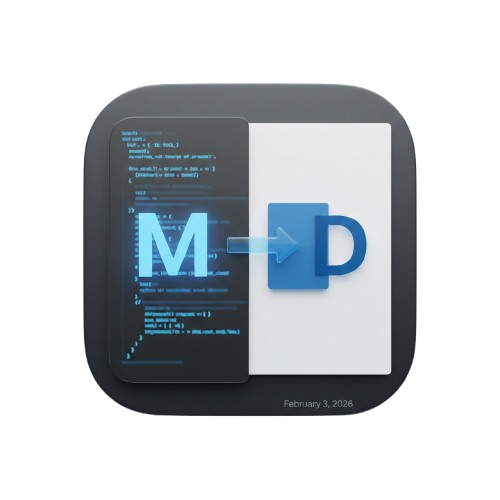

# PureDoc

<p align="center">
  
  <br>
  <b>A Lightweight Markdown to Word Document Conversion Tool</b>
  <br>
  <a href="./README.md">English Documentation</a> | <a href="docs/zh-CN/README-CN.md">简体中文说明文档</a>
</p>

---
## Overview

**PureDoc** is a lightweight Markdown to Word document conversion tool, specifically designed for processing content generated by LLMs (such as ChatGPT, Claude). It efficiently converts Markdown formatted content into well-formatted Word (.docx) documents with real-time preview capabilities, making document processing more convenient and efficient.

---

## Supported Platforms

| Platform | Support Status | Notes |
|----------|----------------|-------|
| macOS | ✅ Fully Supported | Recommended: macOS 12.0 and above |
| Windows | 🚧 Planned | Support in future versions |
| Linux | 🚧 Planned | Support in future versions |

---

## Current Features

✅ **Content Input**: Support importing `.md` or `.markdown` format files via file picker, or directly paste Markdown formatted text into the editor area
✅ **Markdown to Word**: Convert Markdown content to standard Word (.docx) document format
✅ **Word Template Support**: Select custom Word template files (.docx) to apply to output documents, with built-in default template ready to use
✅ **List Style Control**
- **Bullet Point Handling**:
  - Option to ignore unordered list symbols (•) for left-aligned text
  - Preserve original unordered list format
- **Number List Handling**:
  - **Convert to Plain Text**: Convert ordered lists to plain text format (e.g., "1. 2. 3.")
  - **Word Auto List**: Maintain Word's native auto-numbered list format
  - **Ignore Numbers**: Remove all numeric prefixes
  
✅ **Mac Native Preview**: Use macOS QuickLook to preview converted Word document
✅ **Word File Export**: Choose save path and filename, auto-open file after export completion


---


## Installation Guide (macOS)

### Method 1: Download Pre-built Version from Release

1. **Download Application**
   - Download the latest `.dmg` file from the project's [Releases](https://github.com/yourusername/PureDoc/releases) page
   - Or download the packaged `PureDoc.app` archive

2. **Install to Applications**

   **Method A: Drag & Drop Installation (Recommended)**
   ```bash
   # Extract downloaded file
   unzip PureDoc-0.1.0.zip
   # Drag PureDoc.app to /Applications folder
   ```

   **Method B: Command Line Installation**
   ```bash
   # Extract downloaded file
   unzip PureDoc-0.1.0.zip
   # Copy to Applications folder
   cp -r PureDoc.app /Applications/
   ```

3. **Bypass Permission Restrictions**

   If you encounter "cannot be opened because it cannot be verified by developer" message, perform the following:

   **Method A: System Settings (Recommended)**
   1. Open "System Settings" → "Privacy & Security"
   2. Find PureDoc in the "App was blocked from opening" section
   3. Click "Open Anyway" button
   4. Enter administrator password to confirm

   **Method B: Command Line Remove Quarantine Attribute**
   ```bash
   xattr -cr /Applications/PureDoc.app
   ```
   Then try opening the application again.

   **Method C: First Launch Allow**
   1. Right-click on PureDoc.app and select "Open"
   2. Click "Open" in the pop-up dialog
   3. After first successful launch, you can double-click to open it directly

---

## Method 2: Source Code Direct Run

### Prerequisites

**Required Dependency: Pandoc**

Pandoc is the core conversion engine for this tool and must be installed first:

```bash
# Install using Homebrew on macOS
brew install pandoc

# Verify installation
pandoc --version
```

### Running Method

```bash
pip3 install requirements.txt
flet run
```

---

## Method 3: Source Code Compilation

### Prerequisites

**Required Dependency: Pandoc**

Pandoc is the core conversion engine for this tool and must be installed first:

```bash
# Install using Homebrew on macOS
brew install pandoc

# Verify installation
pandoc --version
```

### Compilation Steps

1. **Clone Repository**
   ```bash
   git clone https://github.com/yourusername/PureDoc.git
   cd PureDoc
   ```

2. **Install Python Dependencies**
   ```bash
   pip install -r requirements.txt
   ```

3. **Execute Build**
   ```bash
   python build.py
   ```

   The build script will automatically:
   - Read version number from `src/__init__.py`
   - Sync version to `pyproject.toml`
   - Call Flet build tool to generate `.app` file

4. **Get Build Artifact**
   ```bash
   # After build completion, application is located at
   ls build/PureDoc.app
   ```

---

## Tools Used in This Project

### Core Dependencies

| Tool/Library | Version Requirement | Purpose |
|-------------|-------------------|---------|
| **Pandoc** | 2.19+ | Core conversion engine, handles Markdown to Word format conversion |
| **Python** | 3.10+ | Application runtime environment |
| **Flet** | 0.80.5+ | Cross-platform UI framework, provides clean desktop interface |
| **PyPandoc** | 1.16.2+ | Python wrapper library for Pandoc |

### Development Dependencies

```
flet==0.80.5          # UI framework
pypandoc==1.16.2      # Pandoc Python wrapper
toml==0.10.2          # Config file parsing
```

### Resource Files

| File | Description |
|------|-------------|
| `assets/scripts/bullet_process.lua` | Pandoc Lua filter for list format and soft line break handling |
| `assets/template/template.docx` | Default Word template |
| `assets/icon.png` | Application icon |

### Lua Filter Features

The `bullet_process.lua` script provides the following capabilities:

- **Soft Line Break Handling**: Convert soft line breaks within paragraphs into independent paragraphs
- **Unordered List Control**: Decide whether to add/remove bullet symbols (•) based on configuration
- **Ordered List Control**: Support three modes (plain text, Word list, ignore numbers)

---

## License

This project is licensed under the [MIT License](LICENSE).

---

## Feedback and Contributions

Feel free to submit [Issues](https://github.com/yourusername/PureDoc/issues) or Pull Requests to improve this project.
